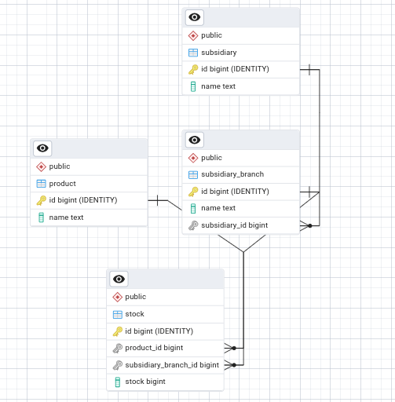

# Evalart Test: Postgres database
## Creator: David Grajales

## Date: 25/10/2025

### Introduction

This is part of the Evalart's test as technical assessment. it a Postgres database that serves as a persistance 
 mean for the backend service.
 
 ### Deployment

 1) Open a terminal and navigate to the containing folder
 2) Execute the next command:

 ```shell
 docker compose up -d
 ```
that's all

### Create a back up

To create a backUp use the next command

```shell
docker exec -t evalart-postgres pg_dump -U user -d evalart-test-db > ./evalart_test_db_backup.sql
```

### ERD schema


